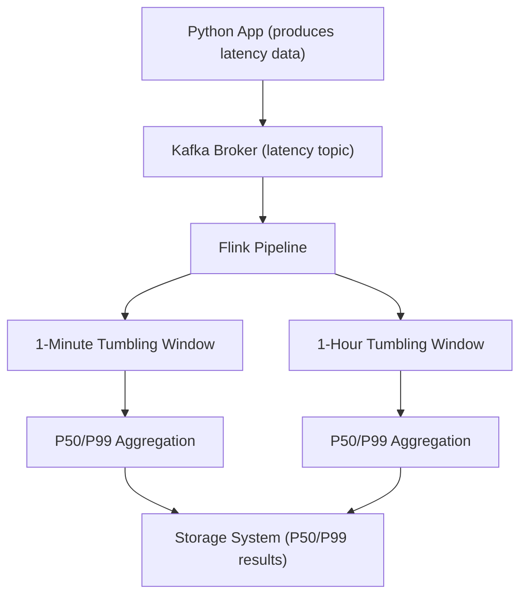

# Flink Kafka Windowing Application

## Overview

This project demonstrates the windowing capability of an Apache Flink consumer application that processes Kafka streams. The primary goal is to test Flink's windowing features by consuming latency data from Kafka, performing aggregations over tumbling windows, and calculating key quantiles like the 50th and 99th percentiles (P50 and P99).


## Project Structure

- **Main Application**: Located in `src/main/kotlin/Main.kt`. This contains the Flink logic for consuming and processing Kafka messages.
- **Producer**: A simple Kafka producer (`producer.py`) located in the `producer` directory, which generates latency messages.
- **Docker Setup**: The `Dockerfile` and `docker-compose.yml` files are provided to set up the required environment, including Kafka, Zookeeper, and Flink.
- **Build Scripts**: The project uses Gradle for building the Flink application.

## Design



This Mermaid diagram represents the architecture of the Flink Kafka Windowing Application. A Python app produces random latency data and sends it to Kafka, which is then consumed by the Flink pipeline. Flink applies two different tumbling windows (1-minute and 1-hour), and performs P50/P99 latency aggregations before outputting the results to a storage system.

### Kafka Source

The Flink application connects to a Kafka broker and reads messages from a topic named `"latency"`. These messages are JSON-encoded and represent latency data, which is parsed into a `KafkaMessage` class.

### Windowing and Aggregation

The application applies two different windowing strategies on the incoming Kafka messages:
- **One-Minute Tumbling Windows**: Aggregates latency data every minute.
- **One-Hour Tumbling Windows**: Aggregates latency data every hour.

For each window, the latencies are processed using a custom `ProcessWindowFunction`, which computes the P50 and P99 percentiles. These values are logged and can be observed in the Flink UI.

### Percentile Calculation

The `calculateQuantile()` function is used to compute the desired quantiles (e.g., P50 and P99) from the latency data within each window.

## Setup Instructions

### Prerequisites

- Docker and Docker Compose
- Kafka and Zookeeper (included in the Docker setup)
- Apache Flink

### Building the Application

To build the Flink job, use the Gradle wrapper provided:

```bash
./gradlew build
```

This will generate a JAR file for the Flink job in `build/libs`.

### Running with Docker Compose

The `docker-compose.yml` file sets up the necessary services (Kafka, Zookeeper, Flink job and task managers, and a Kafka producer). To start the services:

```bash
docker-compose up --build
```

This will spin up the following services:
- **Zookeeper**: Manages Kafka brokers.
- **Kafka**: Handles message queuing for the "latency" topic.
- **Flink JobManager/TaskManager**: Manages the Flink job and task distribution.
- **Producer**: Sends latency data to Kafka.

Once the services are up, you can monitor the Flink dashboard at `http://localhost:8081` and Kafka at `http://localhost:9000`.
